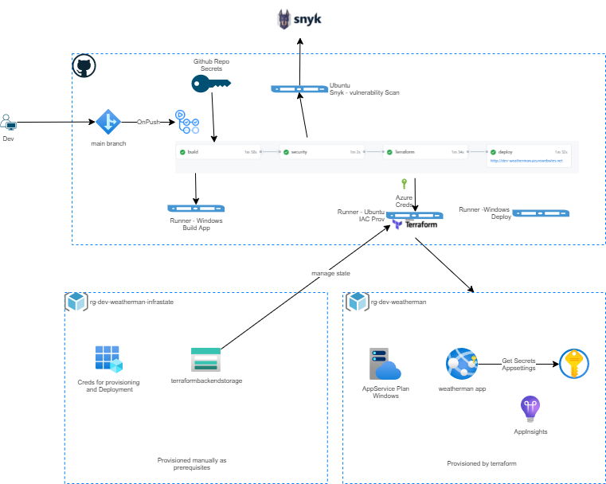

## DevOps Engineer - technical interview

### Testing goals
With this test, we want to see your ability to create a CI/CD pipeline and supporting infrastructure from scratch, as well as your skills as a system administrator.

### The application

The app is a simple weather lookup by user entered locations. 

- The app targets version 3.1 of the dotnet core sdk
- The app is built using [Blazor Server](https://docs.microsoft.com/en-us/aspnet/core/blazor/hosting-models?view=aspnetcore-6.0). 
- The app uses [AccuWeather API](https://developer.accuweather.com/accuweather-locations-api/apis) for lcoations lookup
  -  You will need to create a free account with [AccuWeather](https://developer.accuweather.com/) in order to register an application and call their API.
- The startup application is **BradyWeather.Blazor.Server.csproj**

At the end of the exercise the application should look like below.  

### The task
Your task is to automate the provisioning of resources that host the app provided.
It should be hosted in a highly available and scalable web application hosted in **Azure**. A free account can be created [here](https://azure.microsoft.com/en-gb/free/)
for Azure.  In addition you are required to build and automate the deployment of the application provided. **Please use github actions.**

You should not have to spend any money to complete this exercise. 

Your CI job should:
- Investigate and understand which values need to be swapped as part of CICD pipeline. This needs to be done for the application to work.  
- Run when a branch is pushed to Github (you should fork this repository to your Github account). 
- Deploy to a target environment when the job is successful.
- A clean and minimal working infrastructure is preferred. 
- Consider security.
- Consider tests at all levels. 

### Submission
- Fork the Brady repository provided to a public Github repository. 
- Your solution should be pushed here.  Please do not submit PRs back to the main repository.
- Include a README which desribes how the CI pipeline and any IAC works
- A link to the site that has been deployed. 

### Bonus Points
- Commit often - would rather see a history of trial and error than a single push. 
- Versioning of the deployment
- Write some tests for code and integrate into pipeline

------------------------------------------------------------------------------------------------------------------------
# DevOps Engineer - technical interview submission

## Tasks Breakdown
The requirement is broken down into below tasks
- [X] Pull sorce code locally to build, run and verify.
- [X] Register for an account with Accuweather, get the API key to configure the app.
- [X] Update the app with API key locally to test it. 
- [X] Create CI pipelines using Github actions.
  - [X] Build app and run any unit tests available on every push to main branch. 
  - [X] Store build artifacts
- [X] Create a webapp to manually publish and check whether the app works fine. This is to find out any issues we may find during deployment.
- [X] Infrastructure as code using Terraform 
    - [X] Generate Azure creds for Terraform to provision the infrastruture - Add these as secrets to Github repository.
    - [X] Create Azure storage account to persist the terraform state of the infrastruture
    - [X] Locally create a basic tf files and integrate it with the pipeline.
    - [X] Store Azure Creds as secrets in github repo settings.
    - [X] Store Weather API as secrets
    - [X] As part of IAC create keyvault to load settings to webapp. 
    - [X] Check code for security vulnerabilities
    - [X] Use snyk to scan the code.
    - [X] Publish the result to github.
- [X] Continous deployment
    - [X] After successful build, vulnerability scan and IAC stage deploy the app
- [X] DevOps Solution architecture.
    - [X] Security consideration.
- [ ] Automated testing for quality gate. 
- [X] App Versioning

## DevOps Soultion Diagram

## Pipeline Stages
This is simple version of CICD pipeline to build, test, check for vulnerability, provision environment and deploy.
### Build Stage
   Build is triggered on push to main branch.
   We use dotnet CLI to build the projects and store the build artifacts to github storage. 
   The source code is kept clean from app secrets.
   Added an empty unit test project to run unit test as part of the build. 
### Security Stage
   Registered with snyk for a api key to perform vulnerability scan
   Vulnerability scan is run as part of the pipeline and the results are uploaded to github.
   Note that the action is set to continue on fail to enable the end to end CICD process  to finish. Removing this flag would stop the pipeline from being deployed to environment.
### IAC Stage
  Azure storage is setup outside the IAC configuration to enable Terraform manage the desired state of the application.
  It uses the Azure credentials saved as secrets in github repo settings.
  Note that the Weather API key is not added as part of the provisioing as api key is fed to Azure key vault directly and then used in the Azure appservice settings.
### Deploy Stage
  Deployment uses the Azure creds from github repo secrets.
  Downloads the build artifacts and removes the appsettings file as the settings are referenced from keyvault.

## Deployed App
  You can access the app here https://dev-weatherman.azurewebsites.net/ but use Chrome browser. I did not test on other browser apart from firefox.

## Challenges
   1. Considering the security, I decided to use key vault to store and reference them directly in the appservice settings. There is an option that we can inject the secrets from github secrets into appsettings files but then the value is stored as plain text in Azure webapp. The appsettings with empty value did not allow me to override these settings from Azure appservice settings. So deleted these files and any new appsettings should be provisioned through TF as secrets. 
   2. Initially started building the app in mac environment which proved difficult as the statechanged event is not reliable.
   3. Also during manual testing found  that the app works in Chrome but in Firefox the call to get weather is succcessful but doesnt show the results in the screen. I guess it is due to statechanged event not firing. 
   4. I am new to both Github actions (usually work with Azure pipelines but was able to pick this in no time) and Blazor app (needed some read through from ms docs). In my experience often working alongside with developer always helped me to understand the tech stack and navigate around the code.
 
     
